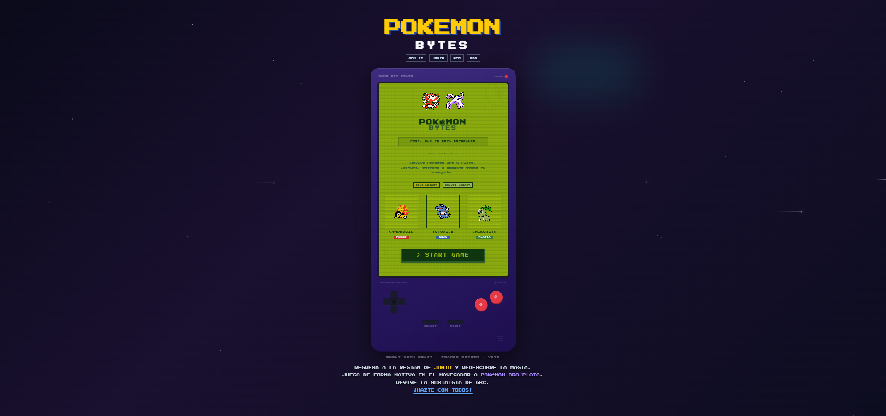
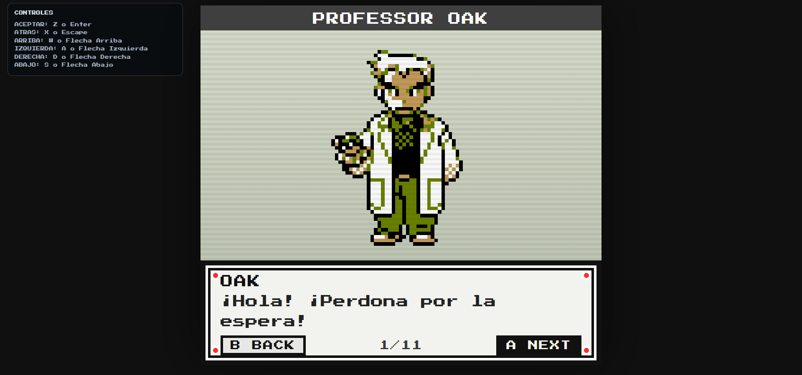
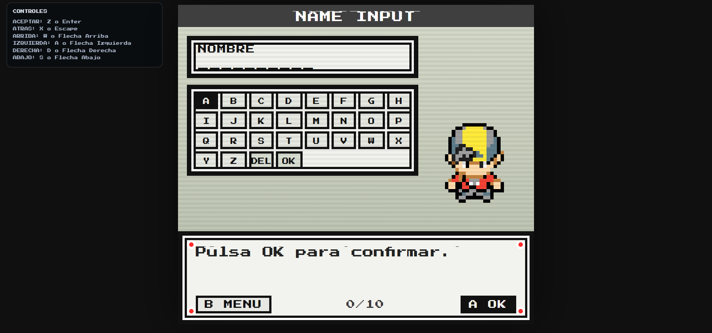

# 🎮🕹️ Pokémon Bytes


> **Arquitectura para la simulación de RPG basada en mecánicas Gen-II (Pokémon Oro/Plata) corriendo nativamente en el navegador.**

---

## 🚀 Arquitectura del Proyecto

El sistema se divide en dos grandes bloques desacoplados: una **API REST (Backend)** robusta que gestiona la lógica de negocio y una **SPA (Frontend)** moderna que recrea la experiencia visual de la Game Boy Color.

### 🧠 Backend (Spring Boot Core)
El servidor gestiona la persistencia, seguridad y cálculos matemáticos en 5 fases:

1.  **Seguridad y Autenticación (Fase I):** Arquitectura Stateless con **JWT**, cifrado **BCrypt** y protección de rutas mediante `JwtAuthenticationFilter`.
2.  **Motor de Batalla (Fase II):** Implementación de fórmulas de daño reales (Gen II), matriz de tipos ($x4.0$ a $x0.0$) y gestión de estados alterados persistentes.
3.  **Economía (Fase III):** Sistema transaccional atómico (`@Transactional`) para Tienda e Inventario, garantizando la integridad en compras.
4.  **Mecánica de Captura (Fase IV):** Algoritmos de probabilidad fieles a Pokémon Oro, gestión de stock de Pokéballs y persistencia dinámica de nuevas capturas.
5.  **Data Seeding (Fase V):** Consumo reactivo de la **PokéAPI** mediante `WebClient` para poblar la base de datos automáticamente.

### 🎨 Frontend (React + Vite)
El cliente web se centra en la fidelidad visual y la experiencia de usuario:

* **Pixel Art:** Renderizado *pixel-perfect* con escalado de enteros para evitar distorsión en pantallas HD.
* **Estética Game Boy Color:** Sistema de diseño basado en **Tailwind CSS** que recrea la paleta de colores original y el hardware físico mediante CSS.
* **Gestión de Estado:** Implementación de **Zustand** para manejar la sesión del usuario (persistencia local) y el estado del juego (equipo, dinero).
* **Animaciones:** Cinemáticas (Intro Profesor Oak) gestionadas con **Framer Motion**.
* **Abstracción de Controles:** Sistema de input agnóstico que permite jugar con Teclado (WASD/Flechas) mapeado a botones de consola (A/B/Start).

---

## 🛠️ Stack Tecnológico

### 🔙 Backend
* **Lenguaje:** Java 21 (JDK 21)
* **Framework:** Spring Boot 3.5.x
* **Base de Datos:** MySQL 8.0
* **Seguridad:** Spring Security 6 + JJWT
* **Herramientas:** Maven, Lombok, Postman

### 🔜 Frontend
* **Core:** React 19 + Vite
* **Estilos:** Tailwind CSS + CSS Modules
* **Estado:** Zustand (con Middleware Persist)
* **HTTP Client:** Axios (con Interceptores JWT)
* **Motion:** Framer Motion v12


---

## 📸 Galería del Proyecto


| Landing Page & Portada | Pantalla de Título Original |
|:---:|:---:|
|  |  |
| *Página de inicio con la "carcasa" de GBC.* | *Recreación pixel de la intro de Oro.* |

| Cinemática de Introducción | Sistema de Entrada de Nombre |
|:---:|:---:|
|  |  |
| *Diálogo narrativo  Profesor Oak.* | *Teclado en pantalla y sprite del jugador.* |

---
---
## 📂 Estructura del Proyecto

El repositorio sigue una estructura de monorepo lógico separado en carpetas raíz:

```text
root/
├── pokemon-backend/         # Servidor Spring Boot (API REST)
│   ├── config/              # Seguridad (CORS, CSRF)
│   ├── controller/          # Endpoints HTTP
│   ├── model/               # Entidades JPA (MySQL)
│   ├── security/            # Lógica JWT
│   └── service/             # Motor de Batalla y Lógica Matemática
│
└── pokemon-frontend/        # Cliente React (SPA)
    ├── src/
    │   ├── assets/          # Sprites, Audio y Tilesets
    │   ├── components/      # UI (PantallaJuego, EscenaApertura)
    │   ├── config/          # Mapeo de Teclas (Input System)
    │   ├── pages/           # Vistas (Login, GameBoy Shell)
    │   ├── services/        # Conexión con API (Axios)
    │   └── store/           # Estado Global (Zustand)
    ├── package.json
    └── vite.config.js
