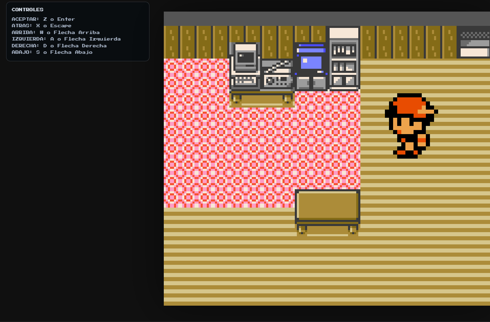
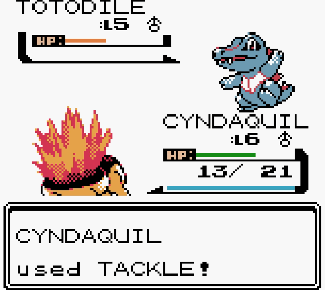
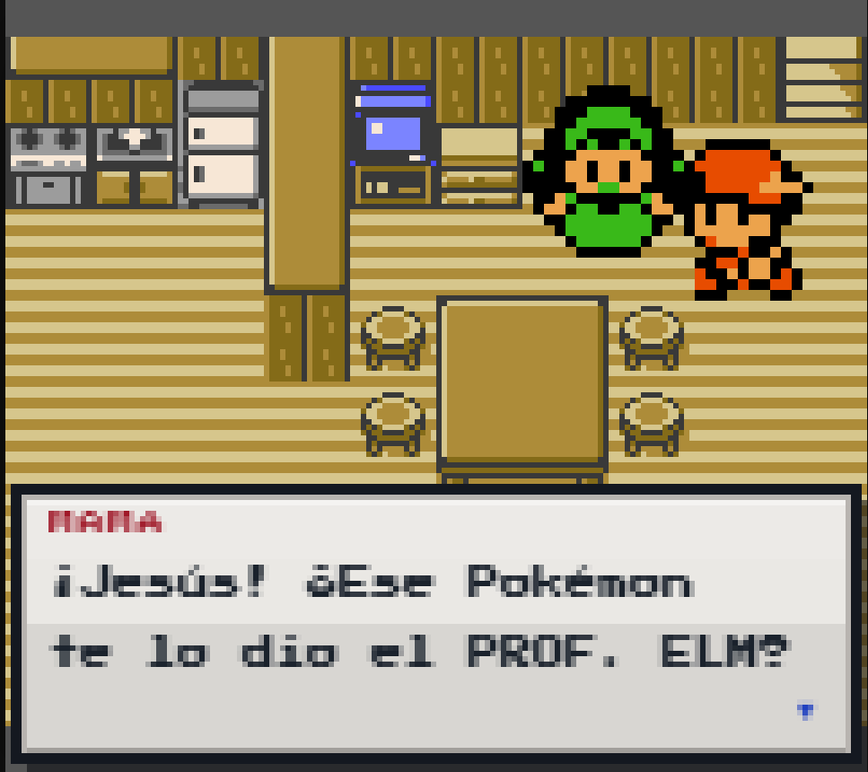
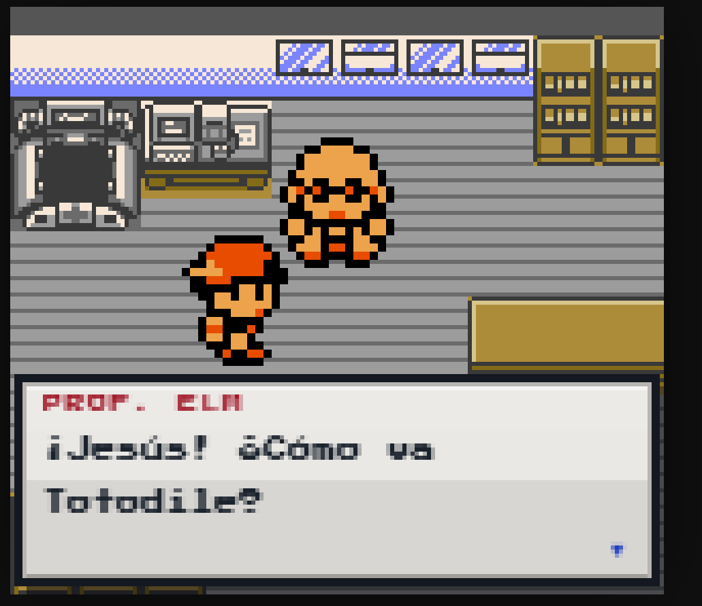
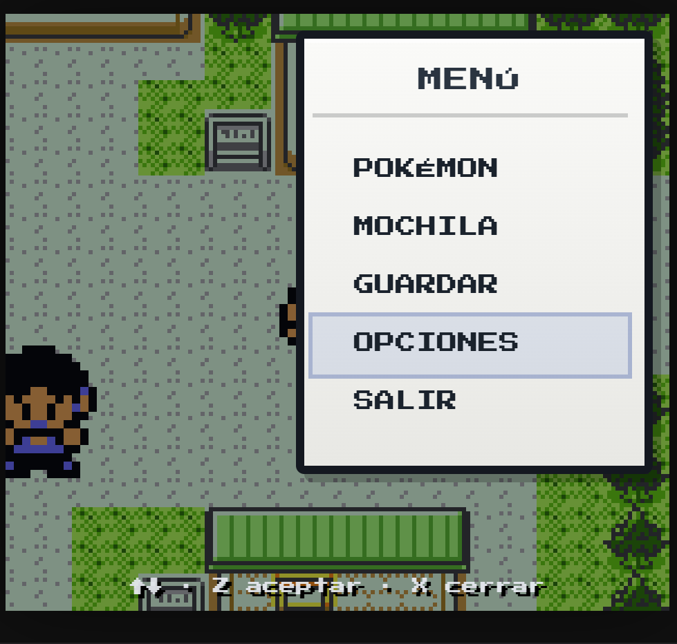
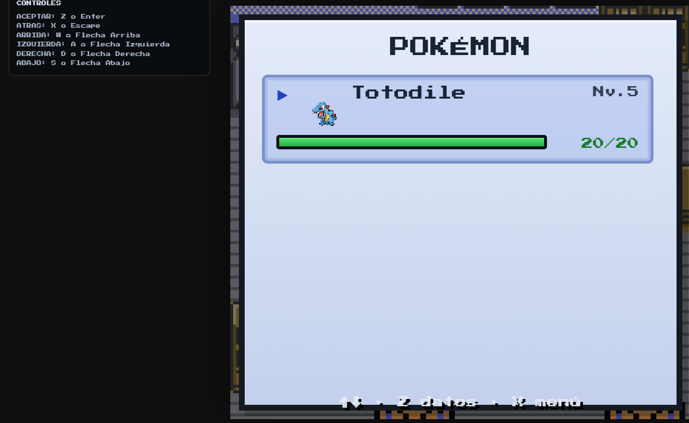
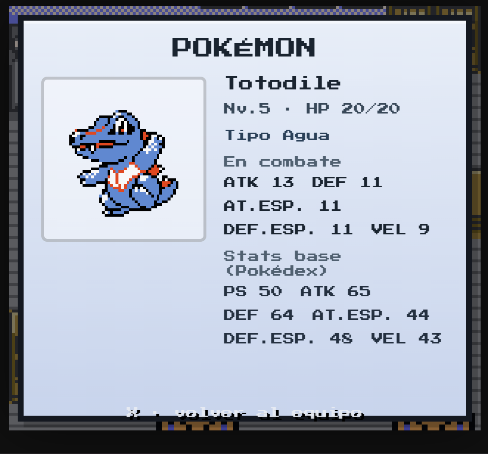
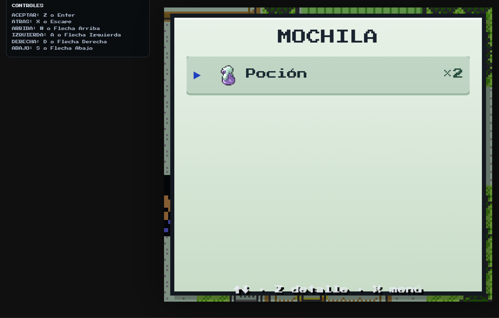
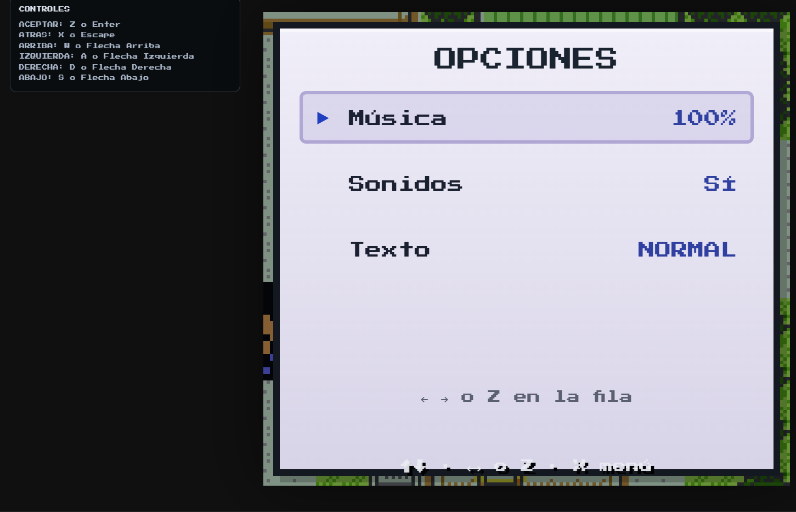
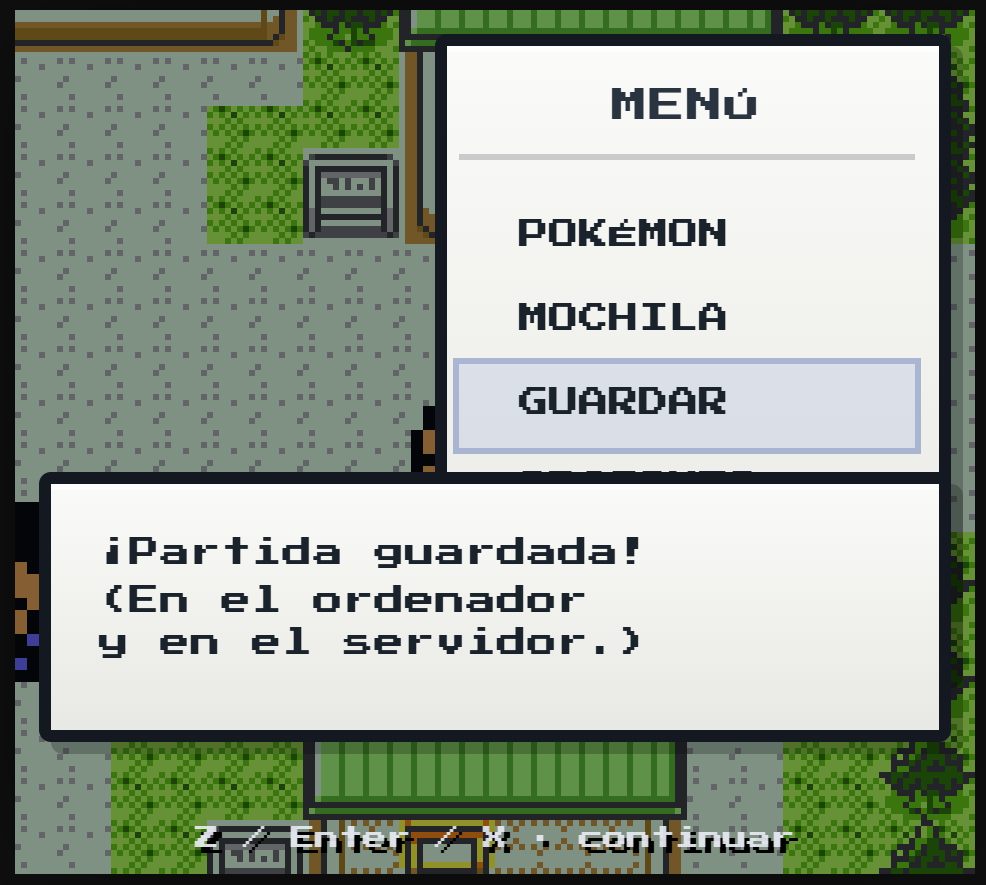

# 🎮🕹️ Pokémon Bytes


> **Arquitectura para la simulación de RPG basada en mecánicas Gen-II (Pokémon Oro/Plata) corriendo nativamente en el navegador.**

---

## ⚠️ Estado Actual del Proyecto

> **Nota (2026-04-11):** El detalle de tareas está en [`docs/dev/NOTAS.md`](docs/dev/NOTAS.md). 
Esta sección resume el estado del código.

### Frontend (En Desarrollo Activo)

#### ✅ Funcionalidades Completadas
- Overworld con **varios mapas Tiled** (JSON), capas, colisiones y **warps** entre mapas (`WarpSystem`)
- New Bark Town, habitación, casa y laboratorio en uso; **encuentros** en hierba donde hay tabla JSON. **Ruta 29 como tramo jugable aún no hecho**
- **Lógica por mapa modularizada** en `pokemon-frontend/src/phaser/mapas/` (p. ej. `casaJugador.js`, `labElm.js`, `johtoOverworld.js`, `dialogosPostStarter.js`) para aligerar `EscenaOverworld.js`.
- **Diálogo in-world:** `SistemaDialogo` con marco GBC (`marcoDialogoRetro.js`), texto y **nombre de hablante**.
- **Menú in-game en React (`MenuIngameReact`):** equipo con **retratos y mini sprites** de los iniciales (`portraitUrls.js`, GIFs en `assets/pokemon/starters/`), datos extra de especie vía **`pokemonDetallePokeapi.js`** (PokéAPI), **stats de combate** que el backend ya envía en el DTO del equipo (`ataque`, `defensa`, `ataqueEspecial`, `defensaEspecial`, `velocidad`, `tipo1` / `tipo2`); mochila y **guardado local y en servidor** (si hay sesión JWT). Opciones de cliente en `config/opcionesCliente.js`.
- **Confirmación de starter** en Phaser (`UIConfirmacionStarter.js`) y diálogos posteriores centralizados en parte en `dialogosPostStarter.js`.
- **`EscenaBatalla`:** carga equipo/movimientos y resuelve turnos contra la **API** del backend
- Estado de juego en **Zustand** con hidratación desde `GET /api/v1/juego/estado` y payload de `POST .../guardar`

#### 🚧 En Desarrollo
- **Cierre de batalla:** flujo completo (resultado, HP persistido, vuelta al mapa) y pulido UI
- **Sistema de colisiones** y pulido de **diálogos / eventos** (siguen bugs conocidos; ver abajo y `NOTAS.md`)
- **Ruta 29** (diseño y contenido del tramo) y más mundo; tienda en overworld, Pokédex, etc.

#### ⚠️ Problemas Conocidos

> **Nota de Desarrollo:** El frontend está en fase de aprendizaje e implementación. Actualmente sigo estudiando y dominando la integración de **React con Phaser 3** y el uso de **Tiled Map Editor**, lo cual está llevando tiempo de investigación y experimentación.
> El proyecto mejorará conforme domine estas herramientas. Los bugs actuales son parte del proceso de aprendizaje.
**Bugs visuales actuales:**
- **Colisiones:** Sistema en proceso de refinamiento mientras aprendo las mejores prácticas de Phaser
- **Casa jugador:** En el diálogo con la madre aparece un placeHolder rosa (entrega del PokeGear). Esto será eliminado, pues no se adapta al juego original dicha acción


### Backend (Funcional)

#### ✅ Completado
- Sistema de autenticación JWT
- Motor de batalla con fórmulas Gen II
- Sistema de economía (tienda + inventario)
- Mecánica de captura
- Data seeding automático desde PokéAPI
- **API de estado de partida** (`/api/v1/juego`): `estado`, `starter`, `equipo`, `guardar` (mapa, posición, dinero, JSON de estado del cliente en `Usuario`). El DTO de cada Pokémon en **equipo** incluye **dos tipos** (`tipo1`, `tipo2` si aplica) y **stats de combate** persistidos para enriquecer el menú del cliente.
- **OpenAPI / Swagger UI** con perfil `dev` (ver `docs/backend/README.md`).

---

## 🚀 Arquitectura del Proyecto

El sistema se divide en dos grandes bloques desacoplados: una **API REST (Backend)** que gestiona la lógica de negocio y una **SPA (Frontend)** que recrea la experiencia de Game Boy Color.

### 🧠 Backend (Spring Boot Core)
El servidor gestiona la persistencia, seguridad y cálculos matemáticos en 5 fases:

1.  **Seguridad y Autenticación (Fase I):** Arquitectura Stateless con **JWT**, cifrado **BCrypt** y protección de rutas mediante `JwtAuthenticationFilter`.
2.  **Motor de Batalla (Fase II):** Implementación de fórmulas de daño reales (Gen II), matriz de tipos ($x4.0$ a $x0.0$) y gestión de estados alterados persistentes.
3.  **Economía (Fase III):** Sistema transaccional atómico (`@Transactional`) para Tienda e Inventario, garantizando la integridad en compras.
4.  **Mecánica de Captura (Fase IV):** Algoritmos de probabilidad fieles a Pokémon Oro, gestión de stock de Pokéballs y persistencia dinámica de nuevas capturas.
5.  **Data Seeding (Fase V):** Consumo reactivo de la **PokéAPI** mediante `WebClient` para poblar la base de datos automáticamente.

### 🎨 Frontend (React + Vite)
El cliente web se centra en la fidelidad visual y la experiencia de usuario:

* **Pixel Art:** Renderizado *pixel-perfect* con escalado de enteros para evitar distorsión en pantallas HD.
* **Estética Game Boy Color:** Sistema de diseño basado en **Tailwind CSS** que recrea la paleta de colores original y el hardware físico mediante CSS.
* **Gestión de Estado:** Implementación de **Zustand** para manejar la sesión del usuario (persistencia local) y el estado del juego (equipo, dinero).
* **Animaciones:** Cinemáticas (Intro Profesor Oak) gestionadas con **Framer Motion**.
* **Abstracción de Controles:** Sistema de input agnóstico que permite jugar con Teclado (WASD/Flechas) mapeado a botones de consola (A/B/Start).

---

## 🛠️ Stack Tecnológico

### 🔙 Backend
* **Lenguaje:** Java 21 (JDK 21)
* **Framework:** Spring Boot 3.5.x
* **Base de Datos:** MySQL 8.0
* **Seguridad:** Spring Security 6 + JJWT
* **Herramientas:** Maven, Lombok, Postman

### 🔜 Frontend
* **Core:** React 19 + Vite
* **Motor de Juego:** Phaser 3.80
* **Estilos:** Tailwind CSS + CSS Modules
* **Estado:** Zustand (con Middleware Persist)
* **HTTP Client:** Axios (con Interceptores JWT)
* **Animaciones:** Framer Motion v12
* **Mapas:** Tiled Map Editor (exportación JSON)


---

## 📸 Galería del Proyecto


| Habitación del jugador | Ejemplo de combate |
|:---:|:---:|
|  |  |
| *Interior Tiled: capas, movimiento por grid y colisiones.* | *`EscenaBatalla` y turnos resueltos vía API (ejemplo visual).* |

| Diálogo en casa | Diálogo en el laboratorio |
|:---:|:---:|
|  |  |
| *Secuencia narrativa en interiores (NPC / familia).* | *Diálogo con el Prof. Elm y seguimiento de la aventura.* |

| Menú in-game | Equipo Pokémon |
|:---:|:---:|
|  |  |
| *Menú pausado sobre el mapa (UI en React).* | *Lista del equipo: nivel, PS y navegación estilo clásico.* |

| Ficha de Pokémon | Mochila |
|:---:|:---:|
|  |  |
| *Detalle de stats, tipo y datos de combate / Pokédex.* | *Inventario de objetos y cantidades.* |

| Opciones | Guardado |
|:---:|:---:|
|  |  |
| *Música, sonidos y ritmo del texto.* | *Confirmación de partida guardada (local y servidor).* |


---
---
## 📂 Estructura del Proyecto

El repositorio sigue una estructura de monorepo lógico separado en carpetas raíz:

```text
root/
├── docs/                    # Documentación y assets de diseño
│   ├── dev/                 # Notas de desarrollo
│   ├── planning/            # Planificación del proyecto
│   ├── screenshots/         # Capturas de pantalla
│   ├── tiled/               # Mapas fuente (Tiled Editor)
│   └── api-tests.http       # Tests de la API REST
│
├── pokemon-backend/         # Servidor Spring Boot (API REST)
│   ├── config/              # Seguridad (CORS, CSRF)
│   ├── controller/          # Endpoints HTTP
│   ├── model/               # Entidades JPA (MySQL)
│   ├── security/            # Lógica JWT
│   └── service/             # Motor de Batalla y Lógica Matemática
│
└── pokemon-frontend/        # Cliente React (SPA)
    ├── src/
    │   ├── assets/          # Sprites, Audio y Tilesets (incl. mini sprites de iniciales)
    │   ├── components/      # UI (PantallaJuego, menú in-game React, shell Game Boy)
    │   ├── config/          # Input, opciones de cliente (p. ej. ritmo de diálogo)
    │   ├── pages/           # Vistas (Login, GameBoy Shell)
    │   ├── phaser/          # Motor Phaser: escenas, `mapas/` por ubicación, sistemas
    │   ├── services/        # API (Axios) y helpers (p. ej. detalle PokéAPI)
    │   └── store/           # Estado Global (Zustand)
    ├── package.json
    └── vite.config.js
```

---

## Nota personal

No me apetecía plantear **el típico CRUD** y cerrar el curso con eso. He crecido con *Pokémon*, así que monté **este proyecto de FP** alrededor de un RPG en el navegador: suena divertido, pero detrás hay **API, base de datos, seguridad**, etc.

Lo que más me gusta es el **backend**: API ordenada, datos, reglas en servidor. En **seguridad** este proyecto toca sobre todo **auth con JWT y API protegida** (no es red team ni pentesting; eso me interesa **aparte** como posible salida, pero **no está en el código** de este repo). La parte **visual** la llevo peor: me peleo un montón con estilos y pixel hasta que “encajan”, y sigo sin sentirme cómodo ahí.

**React + Phaser** me han hecho plantearme **mil veces** dejar el proyecto. Sigo con él porque, aunque me frustre, **al final me gusta lo complicado**: cuando algo encaja después de darle vueltas, compensa.
