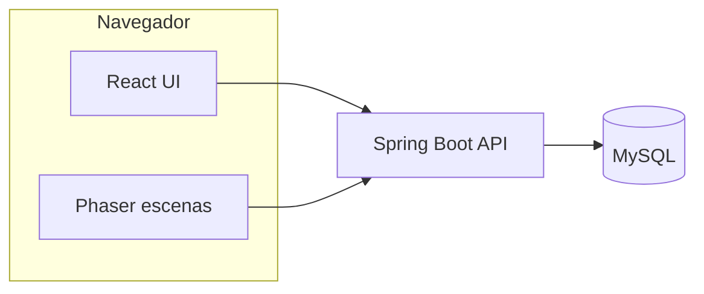

<div align="center">

# Pokémon Bytes

**RPG en el navegador** · Mecánicas **Gen II** (Oro / Plata) · **Phaser** + **React** · **Spring Boot** + **MySQL**

[](#)
[](https://openjdk.org/)
[](https://spring.io/projects/spring-boot)
[](https://www.mysql.com/)

[](https://react.dev/)
[](https://vite.dev/)
[](https://phaser.io/)
[](https://tailwindcss.com/)
[](https://github.com/pmndrs/zustand)
[](https://jwt.io/)

<br />


<br />

[**Demo visual**](#galería-del-proyecto) · [**Arranque local**](#inicio-rápido) · [**Qué hay hecho**](#estado-actual-del-proyecto) · [**Arquitectura**](#arquitectura) · [**Docs**](#documentación) · [**Notas**](./docs/desarrollo/NOTAS.md) · [**Swagger**](./docs/referencia/backend/README.md)

</div>

---

<p align="center">
  <b>Overworld en tilemaps</b> &nbsp;·&nbsp; <b>Combate por turnos en servidor</b> &nbsp;·&nbsp; <b>Menús React sobre el canvas</b> &nbsp;·&nbsp; <b>API REST con JWT</b>
</p>

---

## Tabla de contenidos

<details>
<summary><b>Desplegar índice</b></summary>

- [Galería](#galería-del-proyecto)
- [Destacados](#destacados)
- [Visión](#visión)
- [Inicio rápido](#inicio-rápido)
- [Documentación](#documentación)
- [Estado actual del proyecto](#estado-actual-del-proyecto)
- [Arquitectura](#arquitectura)
- [Stack tecnológico](#stack-tecnológico)
- [Estructura del repositorio](#estructura-del-repositorio)
- [Nota personal](#nota-personal)

</details>

---

## Galería del proyecto

### Capturas

| Landing Page & Portada | Pantalla de Título Original |
|:---:|:---:|
|  |  |
| *Página de inicio con la "carcasa" de GBC.* | *Recreación pixel de la intro de Oro.* |

| Cinemática de Introducción | Sistema de Entrada de Nombre |
|:---:|:---:|
|  |  |
| *Diálogo narrativo con el Profesor Oak.* | *Teclado en pantalla y sprite del jugador.* |

| Habitación del jugador | Ejemplo de combate |
|:---:|:---:|
|  |  |
| *Interior Tiled: capas, movimiento por grid y colisiones.* | *`EscenaBatalla` y turnos resueltos vía API (ejemplo visual).* |

| Diálogo en casa | Diálogo en el laboratorio |
|:---:|:---:|
|  |  |
| *Secuencia narrativa en interiores (NPC / familia).* | *Diálogo con el Prof. Elm y seguimiento de la aventura.* |

| Menú in-game | Equipo Pokémon |
|:---:|:---:|
|  |  |
| *Menú pausado sobre el mapa (UI en React).* | *Lista del equipo: nivel, PS y navegación estilo clásico.* |

| Ficha de Pokémon | Mochila |
|:---:|:---:|
|  |  |
| *Detalle de stats, tipo y datos de combate / Pokédex.* | *Inventario de objetos y cantidades.* |

| Opciones | Guardado |
|:---:|:---:|
|  |  |
| *Música, sonidos y ritmo del texto.* | *Confirmación de partida guardada (local y servidor).* |

---

## Destacados

| | |
|:---|:---|
| **Mundo** | Varios mapas **Tiled** (habitación, casa, New Bark Town, laboratorio Elm, **sala debugger** con NPCs de tienda, centro y combate). |
| **Navegación** | **`WarpSystem`**: puertas y rutas con `destino`, spawn y offsets; sincronización de zonas para no activar warps al aparecer encima de una salida. |
| **Combate** | Turnos en **Spring Boot** (daño Gen II, STAB, crítico, estados alterados, PP, captura); **cambio de Pokémon** voluntario con coste de turno y forzado por KO; sprites dinámicos por `pokedexId`. |
| **XP y nivel** | XP real aplicado tras victoria; subida de nivel automática (nivel²×5); **barra XP animada** en el HUD con reinicio visual al subir; diálogo `BattleLearnMove` para aprender movimientos. |
| **Economía** | **Tienda** con NPC + selector de cantidad; **inventario** completo (tirar / usar fuera de combate); **Centro Pokémon** con NPC enfermera; **Rare Candy** con efecto `LEVEL_UP`. |
| **Estado** | **Zustand**: hidrata desde `GET /estado`, guarda en servidor y en **localStorage**; sync completo post-batalla; Axios con **JWT** y manejo de **401**. |
| **UI** | **React**: menú in-game (equipo, mochila USAR/TIRAR, opciones, guardado); **`BattleBag`** y **`BattleParty`** en combate; HUD con etiqueta de estado alterado. |
| **Audio** | BGM diferenciada para combate salvaje y entrenador; SFX de captura y subida de nivel; música en pantalla de título e intro Oak. |

---

## Visión

Simular un **RPG clásico** con sensación de **Game Boy Color**: rejilla, tilesets, diálogos y combate por turnos, corriendo en el **navegador** y hablando con una **API REST** que concentra datos, economía, capturas y el motor de batalla.

---

## Inicio rápido

> [!TIP]
> Necesitas **JDK 21**, **Node.js** reciente, **MySQL 8** y la configuración de `application.properties` / variables de entorno del backend ([guía](docs/referencia/backend/README.md)).

<table>
<tr>
<td width="50%" valign="top">

### Backend

Puerto por defecto **8081**

```bash
cd pokemon-backend
.\mvnw.cmd spring-boot:run
```

**Swagger** (perfil `dev`): [http://localhost:8081/swagger-ui.html](http://localhost:8081/swagger-ui.html)

</td>
<td width="50%" valign="top">

### Frontend

Vite (suele ser **5173**)

```bash
cd pokemon-frontend
npm install
npm run dev
```

Opcional: copia `pokemon-frontend/.env.example` → `.env` y ajusta **`VITE_API_BASE_URL`**. Si no existe, el cliente usa el mismo host que la página en el puerto **8081**.

</td>
</tr>
</table>

---

## Documentación

| Recurso | Para qué sirve |
|--------|----------------|
| [docs/README.md](docs/README.md) | Índice de toda la carpeta `docs/`. |
| [docs/desarrollo/NOTAS.md](docs/desarrollo/NOTAS.md) | Bugs, prioridades y registro por fecha. |
| [docs/referencia/backend/README.md](docs/referencia/backend/README.md) | API, Maven, puertos. |
| [docs/referencia/diagramas/README.md](docs/referencia/diagramas/README.md) | Diagramas **Mermaid**. |

---

## Estado actual del proyecto

> **Última revisión: 2026-04-27.** Estado general: **proyecto completo y funcional**. El detalle día a día está en [docs/desarrollo/NOTAS.md](docs/desarrollo/NOTAS.md).

### Módulos completados

| Módulo | Estado |
|--------|--------|
| Autenticación / JWT | ✅ BCrypt + JWT 24 h, Spring Security stateless |
| Motor de batalla Gen II | ✅ Daño, STAB, crítico, efectividad, estados alterados, PP persistido, captura, huida, **cambio de Pokémon con coste de turno**, KO forzado |
| Gestión de partida | ✅ Guardar, cargar, reiniciar, starter, sync HP |
| Tienda | ✅ Catálogo, compra, precio unitario — backend + NPC en overworld |
| Inventario | ✅ Añadir, tirar, usar dentro y fuera de combate |
| Centro Pokémon | ✅ Endpoint curar + NPC enfermera en overworld |
| Overworld (Phaser) | ✅ Mapas Tiled, NPCs, warps, encuentros, diálogos con hablante |
| Escena batalla | ✅ HUD React, sprites, estados en UI, sync post-batalla, PP reset, cambio de Pokémon |
| Menú in-game React | ✅ Ficha entrenador, equipo (sprites B/W), mochila (tirar/usar), opciones, guardado |
| Pantalla de título | ✅ Ho-Oh animado, música, Continuar / Nueva partida |
| XP y nivelación | ✅ XP real post-victoria, subida de nivel automática (nivel²×5), barra XP animada con reinicio al subir |
| Rare Candy | ✅ Ítem funcional con efecto `LEVEL_UP` — SQL Flyway V2, semillador, flujo genérico de ítem |
| Aprender movimientos | ✅ `BattleLearnMove` — diálogo al subir nivel para aprender o reemplazar movimientos |
| Audio | ✅ BGM diferenciada (combate salvaje / entrenador), SFX captura y subida de nivel |
| Tests backend | ✅ 31 tests unitarios, 0 fallos (`JuegoServiceTest` × 25, `CalculoServiceTest` × 6) |
| Tests frontend | ✅ Vitest 4 + `happy-dom` · suite en `src/__tests__/` (config, phaser, services, store) |

### Alcance definitivo (descartado por tiempo)

- Evolución de Pokémon
- Pokédex expandida

### Backend

- **Auth**: JWT, BCrypt, Spring Security stateless; Swagger público en perfil `dev`.
- **Batalla Gen II**: daño (STAB, crítico, efectividad ×4 a ×0), estados persistentes, PP por movimiento, learnsets PokéAPI (`gold-silver`); Pokémon salvajes en usuario técnico (`preparar` / `liberar`); reset de PP (`DELETE /pp/{id}`).
- **Economía**: tienda (`POST /comprar`), inventario (`/anadir`, `/tirar`, `/usar`), Centro Pokémon (`POST /centro/curar`), captura con consumo de Ball.
- **API juego** (`/api/v1/juego`): `estado`, `equipo`, `starter`, `guardar`, `reiniciar`, `inventario/anadir`, `inventario/tirar`, `inventario/usar`, `centro/curar`.
- DTO de equipo con `tipo1` / `tipo2` y stats de combate. Flyway para migraciones de esquema.
- **OpenAPI / Swagger**: [docs/referencia/backend/README.md](docs/referencia/backend/README.md).

### Frontend

- **Overworld**: mapas Tiled (JSON), colisiones, movimiento a grid, cámara, `WarpSystem`, `SistemaEncuentros`; flujos NPC de tienda (selector de cantidad) y Centro Pokémon.
- **Sala debugger**: NPCs de combate por estado alterado, NPC captura (10 Pokémon Johto aleatorios), tienda y centro.
- **`EscenaBatalla`**: HUD con etiqueta de estado (PAR/VEN/DOR…), sprites dinámicos por `pokedexId` (Gen V + fallback Crystal), `BattleBag` (mochila en combate), `BattleParty` (cambio voluntario y forzado por KO), sync al salir.
- **Menú in-game** (`MenuIngameReact`): ficha entrenador, equipo con sprites animados B/W, mochila (USAR / TIRAR con picker de Pokémon), opciones de audio y texto, guardado local + servidor.
- **`usarJuegoStore`**: hidrata desde servidor, caché local, tiempo de juego, `patchEquipoLocal`.
- **`services/api.js`**: JWT en cada request, 401 → logout automático.
- **Tests**: Vitest + `happy-dom`; tests en `src/__tests__/` (config, phaser, services, store).

---

## Arquitectura

SPA **React + Phaser** en el cliente; **Spring Boot** como núcleo de reglas y datos; **MySQL** como almacén. Comunicación **HTTP** con **JWT** en rutas protegidas.


```mermaid
flowchart LR
  subgraph Navegador["Navegador"]
    R[React UI]
    P[Phaser escenas]
  end
  API[Spring Boot API]
  DB[(MySQL)]

  R --> API
  P --> API
  API --> DB
```

Más diagramas (seguridad, dominio, captura, daño): [docs/referencia/diagramas/README.md](docs/referencia/diagramas/README.md).

### Backend (cinco bloques)

1. **Seguridad:** JWT, BCrypt, `FiltroAutenticacionJwt`
2. **Batalla:** daño Gen II, tipos (×4.0 a ×0.0), estados persistentes
3. **Economía:** tienda e inventario con `@Transactional`
4. **Captura:** fórmula estilo Oro, stock de Balls, persistencia
5. **Seeding:** PokéAPI con `WebClient`

### Frontend

- Pixel art con **escala entera** (menos blur en HD)
- Estética **GBC** (Tailwind + CSS propio)
- Estado con **Zustand**
- Intro y transiciones con **Framer Motion**
- Controles: WASD / flechas → A / B / Start (mapeo lógico)

---

## Stack tecnológico

| Capa | Tecnologías |
|------|-------------|
| **Backend** | Java 21, Spring Boot 3.5.x, MySQL 8, Spring Security 6 + JJWT, Flyway, Maven, Lombok |
| **Frontend** | React 19, Vite 7, Phaser 3.90, Tailwind CSS 3.4, Zustand 5, Axios, Framer Motion 12, Vitest 4, Tiled (export JSON) |

---

## Estructura del repositorio

Monorepo en carpetas raíz:

```text
root/
├── docs/                    # Documentación y assets
│   ├── referencia/          # Backend + diagramas Mermaid
│   ├── desarrollo/          # NOTAS, defensa FP, mejoras
│   ├── proyecto/            # Memoria / PROYECTO.md
│   ├── screenshots/
│   ├── tiled/               # Fuente .tmx (Tiled Editor)
│   └── api-tests.http
│
├── pokemon-backend/         # Spring Boot (REST)
│   ├── src/main/java/.../
│   └── pom.xml
│
└── pokemon-frontend/        # React + Vite + Phaser
    ├── src/
    │   ├── assets/
    │   ├── components/
    │   ├── config/
    │   ├── pages/
    │   ├── phaser/
    │   ├── services/
    │   ├── store/
    │   └── __tests__/       # Vitest (config, phaser, services, store)
    ├── package.json
    ├── vite.config.js
    └── vitest.config.js
```

---

## Nota personal

No me apetecía plantear **el típico CRUD** y cerrar el curso con eso. He crecido con *Pokémon*, así que monté **este proyecto de FP** alrededor de un RPG en el navegador: suena divertido, pero detrás hay **API, base de datos, seguridad**, etc.

Lo que más me gusta es el **backend**: API ordenada, datos, reglas en servidor. En **seguridad** este proyecto toca sobre todo **auth con JWT y API protegida** (no es red team ni pentesting; eso me interesa **aparte** como posible salida, pero **no está en el código** de este repo). La parte **visual** la llevo peor: me peleo un montón con estilos y pixel hasta que “encajan”, y sigo sin sentirme cómodo ahí.

**React + Phaser** me han hecho plantearme **mil veces** dejar el proyecto. Sigo con él porque, aunque me frustre, **al final me gusta lo complicado**: cuando algo encaja después de darle vueltas, compensa.
