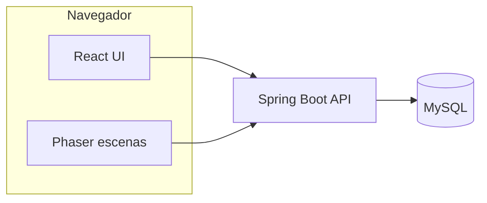

<div align="center">

# 🎮🕹️ Pokémon Bytes

**RPG en el navegador** con mecánicas **Gen II** (Oro / Plata): overworld en **Phaser**, menús en **React**, reglas y persistencia en **Spring Boot**.


[](https://openjdk.org/)
[](https://spring.io/projects/spring-boot)
[](https://www.mysql.com/)
[](https://jwt.io/)

[](https://react.dev/)
[](https://vite.dev/)
[](https://phaser.io/)
[](https://tailwindcss.com/)
[](https://github.com/pmndrs/zustand)

[Estado del proyecto](#estado-actual-del-proyecto) · [Arquitectura](#arquitectura) · [Stack](#stack-tecnológico) · [Galería](#galería-del-proyecto) · [Estructura](#estructura-del-repositorio) · [Notas de desarrollo](docs/dev/NOTAS.md) · [Backend (Swagger, tests)](docs/backend/README.md)

</div>

> **Arquitectura para la simulación de RPG basada en mecánicas Gen-II (Pokémon Oro/Plata) corriendo nativamente en el navegador.**

---

## Tabla de contenidos

- [Galería](#galería-del-proyecto)
- [Visión](#visión)
- [Inicio rápido](#inicio-rápido)
- [Estado actual del proyecto](#estado-actual-del-proyecto)
- [Arquitectura](#arquitectura)
- [Stack tecnológico](#stack-tecnológico)
- [Estructura del repositorio](#estructura-del-repositorio)
- [Nota personal](#nota-personal)

---

## Galería del proyecto

### 📸 Capturas de pantalla

| Landing Page & Portada | Pantalla de Título Original |
|:---:|:---:|
|  |  |
| *Página de inicio con la "carcasa" de GBC.* | *Recreación pixel de la intro de Oro.* |

| Cinemática de Introducción | Sistema de Entrada de Nombre |
|:---:|:---:|
|  |  |
| *Diálogo narrativo con el Profesor Oak.* | *Teclado en pantalla y sprite del jugador.* |

| Habitación del jugador | Ejemplo de combate |
|:---:|:---:|
|  |  |
| *Interior Tiled: capas, movimiento por grid y colisiones.* | *`EscenaBatalla` y turnos resueltos vía API (ejemplo visual).* |

| Diálogo en casa | Diálogo en el laboratorio |
|:---:|:---:|
|  |  |
| *Secuencia narrativa en interiores (NPC / familia).* | *Diálogo con el Prof. Elm y seguimiento de la aventura.* |

| Menú in-game | Equipo Pokémon |
|:---:|:---:|
|  |  |
| *Menú pausado sobre el mapa (UI en React).* | *Lista del equipo: nivel, PS y navegación estilo clásico.* |

| Ficha de Pokémon | Mochila |
|:---:|:---:|
|  |  |
| *Detalle de stats, tipo y datos de combate / Pokédex.* | *Inventario de objetos y cantidades.* |

| Opciones | Guardado |
|:---:|:---:|
|  |  |
| *Música, sonidos y ritmo del texto.* | *Confirmación de partida guardada (local y servidor).* |

---

## Visión

Simular un **RPG clásico** con la sensación de **Game Boy Color**: grid, tilesets, diálogos y combate por turnos, pero corriendo **nativamente en el navegador** y hablando con una **API REST** que concentra datos, economía, capturas y el motor de batalla.

---

## Inicio rápido

> [!TIP]
> Necesario **JDK 21**, **Node.js** reciente, **MySQL 8** y variables / `application.properties` configurados para el entorno (ver documentación del backend).

**Backend** (puerto por defecto **8081**):

```bash
cd pokemon-backend
.\mvnw.cmd spring-boot:run
```

Swagger UI (perfil `dev`): `http://localhost:8081/swagger-ui.html` — ver [docs/backend/README.md](docs/backend/README.md).

**Frontend** (Vite, suele ser **5173**):

```bash
cd pokemon-frontend
npm install
npm run dev
```

---

## Estado actual del proyecto

> **Nota (2026-04-11):** El detalle de tareas vive en [`docs/dev/NOTAS.md`](docs/dev/NOTAS.md). Aquí va un resumen ejecutivo. Estado general: **frontend en evolución**, **backend operativo**.

### Frontend (en desarrollo activo)

#### ✅ Funcionalidades completadas

- Overworld con **varios mapas Tiled** (JSON), capas, colisiones y **warps** entre mapas (`WarpSystem`)
- New Bark Town, habitación, casa y laboratorio en uso; **encuentros** en hierba donde hay tabla JSON. **Ruta 29 como tramo jugable aún no hecho**
- **Lógica por mapa modularizada** en `pokemon-frontend/src/phaser/mapas/` (p. ej. `casaJugador.js`, `labElm.js`, `johtoOverworld.js`, `dialogosPostStarter.js`) para aligerar `EscenaOverworld.js`
- **Diálogo in-world:** `SistemaDialogo` con marco GBC (`marcoDialogoRetro.js`), texto y **nombre de hablante**
- **Menú in-game en React (`MenuIngameReact`):** equipo con **retratos y mini sprites** de los iniciales (`portraitUrls.js`, GIFs en `assets/pokemon/starters/`), datos extra de especie vía **`pokemonDetallePokeapi.js`** (PokéAPI), **stats de combate** que el backend ya envía en el DTO del equipo (`ataque`, `defensa`, `ataqueEspecial`, `defensaEspecial`, `velocidad`, `tipo1` / `tipo2`); mochila y **guardado local y en servidor** (si hay sesión JWT). Opciones de cliente en `config/opcionesCliente.js`
- **Confirmación de starter** en Phaser (`UIConfirmacionStarter.js`) y diálogos posteriores centralizados en parte en `dialogosPostStarter.js`
- **`EscenaBatalla`:** carga equipo/movimientos y resuelve turnos contra la **API** del backend
- Estado de juego en **Zustand** con hidratación desde `GET /api/v1/juego/estado` y payload de `POST .../guardar`

#### 🚧 En desarrollo

- **Cierre de batalla:** flujo completo (resultado, HP persistido, vuelta al mapa) y pulido UI
- **Sistema de colisiones** y pulido de **diálogos / eventos** (siguen bugs conocidos; ver abajo y `NOTAS.md`)
- **Ruta 29** (diseño y contenido del tramo) y más mundo; tienda en overworld, Pokédex, etc.

#### ⚠️ Problemas conocidos

> **Nota de desarrollo:** El frontend está en fase de aprendizaje e implementación. Sigo estudiando la integración **React + Phaser 3** y **Tiled**; los bugs actuales forman parte de ese proceso.

**Bugs visuales / de gameplay actuales:**

- **Colisiones:** sistema en refinamiento mientras afino buenas prácticas en Phaser
- **Casa jugador:** en el diálogo con la madre aparece un placeholder rosa (entrega del PokeGear); se eliminará porque no encaja con el flujo del juego original

### Backend (funcional)

#### ✅ Completado

- Sistema de autenticación JWT
- Motor de batalla con fórmulas Gen II
- Sistema de economía (tienda + inventario)
- Mecánica de captura
- Data seeding automático desde PokéAPI
- **API de estado de partida** (`/api/v1/juego`): `estado`, `starter`, `equipo`, `guardar` (mapa, posición, dinero, JSON de estado del cliente en `Usuario`). El DTO de cada Pokémon en **equipo** incluye **dos tipos** (`tipo1`, `tipo2` si aplica) y **stats de combate** persistidos para enriquecer el menú del cliente
- **OpenAPI / Swagger UI** con perfil `dev` (ver `docs/backend/README.md`)

---

## Arquitectura

SPA **React + Phaser** en el cliente; **Spring Boot** como núcleo de reglas y datos; **MySQL** como almacén. Comunicación **HTTP** con **JWT** en rutas protegidas.


```mermaid
flowchart LR
  subgraph Navegador["Navegador"]
    R[React UI]
    P[Phaser escenas]
  end
  API[Spring Boot API]
  DB[(MySQL)]

  R --> API
  P --> API
  API --> DB
```

Documentación gráfica del proyecto (**Mermaid** en un solo archivo: seguridad, API, dominio, ACID, captura, arranque, daño): [docs/diagramas/README.md](docs/diagramas/README.md).

### 🧠 Backend (Spring Boot)

El servidor cubre persistencia, seguridad y cálculos en **cinco bloques**:

1. **Seguridad (Fase I):** stateless con **JWT**, **BCrypt** y `FiltroAutenticacionJwt`
2. **Motor de batalla (Fase II):** daño Gen II, matriz de tipos ($\times 4.0$ a $\times 0.0$) y estados alterados persistentes
3. **Economía (Fase III):** tienda e inventario con `@Transactional`
4. **Captura (Fase IV):** probabilidades al estilo Oro, stock de Pokéballs y persistencia de nuevas capturas
5. **Seeding (Fase V):** **PokéAPI** vía `WebClient` para poblar la base de datos

### 🎨 Frontend (React + Vite)

- **Pixel art:** escalado entero para evitar “blur” en pantallas HD
- **Estética GBC:** Tailwind y CSS acorde a paleta y sensación de hardware
- **Estado:** **Zustand** (sesión y partida)
- **Animaciones:** intro y transiciones con **Framer Motion**
- **Controles:** teclado (WASD / flechas) mapeado a botones de consola (A / B / Start)

---

## Stack tecnológico

| Capa | Tecnologías |
|------|-------------|
| **Backend** | Java 21, Spring Boot 3.5.x, MySQL 8, Spring Security 6 + JJWT, Maven, Lombok |
| **Frontend** | React 19, Vite 7, Phaser 3.90, Tailwind CSS 3.4, Zustand 5, Axios, Framer Motion 12, Tiled (export JSON) |

---

## Estructura del repositorio

Monorepo lógico en carpetas raíz:

```text
root/
├── docs/                    # Documentación y assets de diseño
│   ├── diagramas/           # Diagramas Mermaid (arquitectura, API, ER)
│   ├── dev/                 # Notas de desarrollo
│   ├── planning/            # Planificación del proyecto
│   ├── screenshots/         # Capturas de pantalla
│   ├── tiled/               # Mapas fuente (Tiled Editor)
│   └── api-tests.http       # Tests de la API REST
│
├── pokemon-backend/         # Servidor Spring Boot (API REST)
│   ├── src/main/java/.../   # config, controller, filter, model, repository, security, service, …
│   └── pom.xml
│
└── pokemon-frontend/        # Cliente React (SPA)
    ├── src/
    │   ├── assets/          # Sprites, audio y tilesets (incl. mini sprites de iniciales)
    │   ├── components/      # UI (PantallaJuego, menú in-game React, shell Game Boy)
    │   ├── config/          # Input, opciones de cliente (p. ej. ritmo de diálogo)
    │   ├── pages/           # Vistas (Login, GameBoy Shell)
    │   ├── phaser/          # Motor Phaser: escenas, mapas/ por ubicación, sistemas
    │   ├── services/        # API (Axios) y helpers (p. ej. detalle PokéAPI)
    │   └── store/           # Estado global (Zustand)
    ├── package.json
    └── vite.config.js
```

---

## Nota personal

No me apetecía plantear **el típico CRUD** y cerrar el curso con eso. He crecido con *Pokémon*, así que monté **este proyecto de FP** alrededor de un RPG en el navegador: suena divertido, pero detrás hay **API, base de datos, seguridad**, etc.

Lo que más me gusta es el **backend**: API ordenada, datos, reglas en servidor. En **seguridad** este proyecto toca sobre todo **auth con JWT y API protegida** (no es red team ni pentesting; eso me interesa **aparte** como posible salida, pero **no está en el código** de este repo). La parte **visual** la llevo peor: me peleo un montón con estilos y pixel hasta que “encajan”, y sigo sin sentirme cómodo ahí.

**React + Phaser** me han hecho plantearme **mil veces** dejar el proyecto. Sigo con él porque, aunque me frustre, **al final me gusta lo complicado**: cuando algo encaja después de darle vueltas, compensa.
