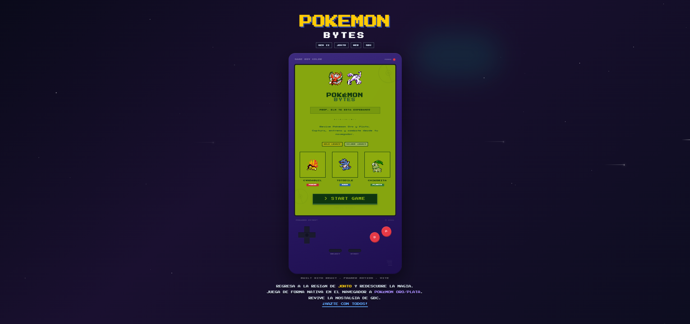
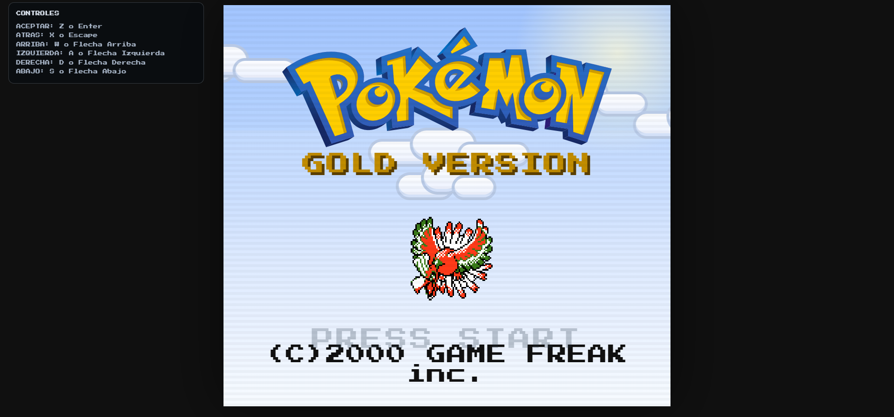
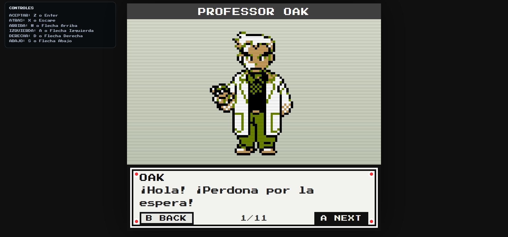
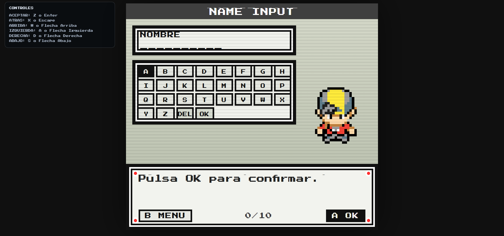

# 🎮🕹️ Pokémon Bytes


> **Arquitectura para la simulación de RPG basada en mecánicas Gen-II (Pokémon Oro/Plata) corriendo nativamente en el navegador.**

---

## ⚠️ Estado Actual del Proyecto

### Frontend (En Desarrollo Activo)

#### ✅ Funcionalidades Completadas
- Pantalla de título con animación
- Cinemática de introducción (Profesor Oak)
- Sistema de entrada de nombre del jugador
- Animación de transición (sprite encogimiento)

#### 🚧 En Desarrollo
- **Sistema de mapas:** Los mapas tras la introducción están en fase de implementación
- **Renderizado de tilesets:** Actualmente usando mapas json, en caso de no renderizar se usan placeholders visuales
- **Sistema de colisiones:** En proceso de refinamiento (bugs)

#### ⚠️ Problemas Conocidos

> **Nota de Desarrollo:** El frontend está en fase de aprendizaje e implementación. Actualmente estoy estudiando y dominando la integración de **React con Phaser 3** y el uso de **Tiled Map Editor**, lo cual está llevando tiempo de investigación y experimentación.

**Bugs visuales actuales:**
- **Después de introducir el nombre:** La transición al overworld puede mostrar gráficos placeholder o bugs visuales debido a la configuración de tilesets
- **Colisiones:** Sistema en proceso de refinamiento mientras aprendo las mejores prácticas de Phaser
- **Elección starter:** Actualmente al seleccionar un starter, no hay opción de cancelar 
- **Evento de Elm:** Según el movimiento del personaje, la activación del evento provoca cambios de posición dentro del mismo laboratorio

**Tecnologías en aprendizaje:**
- 🎮 **Phaser 3:** Motor de juego 2D (sistema de escenas, sprites, física)
- 🗺️ **Tiled Map Editor:** Creación y exportación de mapas
- ⚛️ **React + Phaser:** Integración de ambos frameworks sin conflictos
- 🎨 **Pixel Art Pipeline:** Workflow desde diseño hasta implementación

> El proyecto mejorará conforme domine estas herramientas. Los bugs actuales son parte del proceso de aprendizaje.

### Backend (Funcional)

#### ✅ Completado
- Sistema de autenticación JWT
- Motor de batalla con fórmulas Gen II
- Sistema de economía (tienda + inventario)
- Mecánica de captura
- Data seeding automático desde PokéAPI

---

## 🚀 Arquitectura del Proyecto

El sistema se divide en dos grandes bloques desacoplados: una **API REST (Backend)** robusta que gestiona la lógica de negocio y una **SPA (Frontend)** moderna que recrea la experiencia visual de la Game Boy Color.

### 🧠 Backend (Spring Boot Core)
El servidor gestiona la persistencia, seguridad y cálculos matemáticos en 5 fases:

1.  **Seguridad y Autenticación (Fase I):** Arquitectura Stateless con **JWT**, cifrado **BCrypt** y protección de rutas mediante `JwtAuthenticationFilter`.
2.  **Motor de Batalla (Fase II):** Implementación de fórmulas de daño reales (Gen II), matriz de tipos ($x4.0$ a $x0.0$) y gestión de estados alterados persistentes.
3.  **Economía (Fase III):** Sistema transaccional atómico (`@Transactional`) para Tienda e Inventario, garantizando la integridad en compras.
4.  **Mecánica de Captura (Fase IV):** Algoritmos de probabilidad fieles a Pokémon Oro, gestión de stock de Pokéballs y persistencia dinámica de nuevas capturas.
5.  **Data Seeding (Fase V):** Consumo reactivo de la **PokéAPI** mediante `WebClient` para poblar la base de datos automáticamente.

### 🎨 Frontend (React + Vite)
El cliente web se centra en la fidelidad visual y la experiencia de usuario:

* **Pixel Art:** Renderizado *pixel-perfect* con escalado de enteros para evitar distorsión en pantallas HD.
* **Estética Game Boy Color:** Sistema de diseño basado en **Tailwind CSS** que recrea la paleta de colores original y el hardware físico mediante CSS.
* **Gestión de Estado:** Implementación de **Zustand** para manejar la sesión del usuario (persistencia local) y el estado del juego (equipo, dinero).
* **Animaciones:** Cinemáticas (Intro Profesor Oak) gestionadas con **Framer Motion**.
* **Abstracción de Controles:** Sistema de input agnóstico que permite jugar con Teclado (WASD/Flechas) mapeado a botones de consola (A/B/Start).

---

## 🛠️ Stack Tecnológico

### 🔙 Backend
* **Lenguaje:** Java 21 (JDK 21)
* **Framework:** Spring Boot 3.5.x
* **Base de Datos:** MySQL 8.0
* **Seguridad:** Spring Security 6 + JJWT
* **Herramientas:** Maven, Lombok, Postman

### 🔜 Frontend
* **Core:** React 19 + Vite
* **Motor de Juego:** Phaser 3.80
* **Estilos:** Tailwind CSS + CSS Modules
* **Estado:** Zustand (con Middleware Persist)
* **HTTP Client:** Axios (con Interceptores JWT)
* **Animaciones:** Framer Motion v12
* **Mapas:** Tiled Map Editor (exportación JSON)


---

## 📸 Galería del Proyecto


| Landing Page & Portada | Pantalla de Título Original |
|:---:|:---:|
|  |  |
| *Página de inicio con la "carcasa" de GBC.* | *Recreación pixel de la intro de Oro.* |

| Cinemática de Introducción | Sistema de Entrada de Nombre |
|:---:|:---:|
|  |  |
| *Diálogo narrativo  Profesor Oak.* | *Teclado en pantalla y sprite del jugador.* |

---
---
## 📂 Estructura del Proyecto

El repositorio sigue una estructura de monorepo lógico separado en carpetas raíz:

```text
root/
├── docs/                    # Documentación y assets de diseño
│   ├── dev/                 # Notas de desarrollo
│   ├── planning/            # Planificación del proyecto
│   ├── screenshots/         # Capturas de pantalla
│   ├── tiled/               # Mapas fuente (Tiled Editor)
│   └── api-tests.http       # Tests de la API REST
│
├── pokemon-backend/         # Servidor Spring Boot (API REST)
│   ├── config/              # Seguridad (CORS, CSRF)
│   ├── controller/          # Endpoints HTTP
│   ├── model/               # Entidades JPA (MySQL)
│   ├── security/            # Lógica JWT
│   └── service/             # Motor de Batalla y Lógica Matemática
│
└── pokemon-frontend/        # Cliente React (SPA)
    ├── src/
    │   ├── assets/          # Sprites, Audio y Tilesets
    │   ├── components/      # UI (PantallaJuego, EscenaApertura)
    │   ├── config/          # Mapeo de Teclas (Input System)
    │   ├── pages/           # Vistas (Login, GameBoy Shell)
    │   ├── phaser/          # Motor de juego Phaser
    │   ├── services/        # Conexión con API (Axios)
    │   └── store/           # Estado Global (Zustand)
    ├── package.json
    └── vite.config.js


---

## 🎓 Desafíos Técnicos

Este proyecto esta representando un desafío técnico al combinar tecnologías que no suelen trabajar juntas:

### Integración React + Phaser
- **Desafío:** React y Phaser manejan el DOM de formas diferentes
- **Aprendizaje:** Gestión del ciclo de vida de Phaser dentro de componentes React
- **Estado:** En proceso de dominio

### Tiled Map Editor
- **Desafío:** Exportar mapas JSON compatibles con Phaser
- **Aprendizaje:** Configuración de tilesets, capas, propiedades de objetos
- **Estado:** Curva de aprendizaje en progreso

### Phaser 3 Game Engine
- **Desafío:** Sistema de escenas, física, sprites, animaciones
- **Aprendizaje:** Arquitectura de juegos 2D, optimización de rendimiento
- **Estado:** Implementación iterativa

### Pixel Art Pipeline
- **Desafío:** Mantener fidelidad visual de Game Boy Color
- **Aprendizaje:** Escalado pixel-perfect, paletas de colores, tilesets
- **Estado:** Refinamiento continuo

> **Transparencia:** Los bugs visuales actuales son resultado directo de este proceso de aprendizaje. Cada error es una me permite entender mejor cómo funcionan estas herramientas juntas.


### ¿Por qué no cambio a herramientas más simples?

A pesar de los desafíos, he decidido mantener este stack tecnológico por :

#### 1. **Fidelidad a la Visión Original**
- Phaser 3 es el motor más adecuado para recrear la experiencia de Game Boy Color en navegador
- Tiled es el estándar de la industria para diseño de mapas 2D
- React permite una arquitectura moderna y escalable

#### 2. **Aprendizaje**
- Estas herramientas son **ampliamente usadas en la industria** del desarrollo de juegos web
- Dominar la integración React + Phaser es una habilidad diferenciadora
- El conocimiento adquirido es transferible a otros proyectos

#### 3. **Escalabilidad del Proyecto**
- Phaser permite añadir fácilmente: animaciones complejas, partículas, efectos visuales
- Tiled facilita la creación de nuevos mapas sin tocar código
- React + Zustand permiten gestionar estados complejos de forma predecible

#### 4. **Desafío Técnico Real**
- Resolver estos problemas me permite crecer en capacidad de **investigación y resolución de problemas**
- Trabajar con documentación oficial y comunidades
- Aprender a debuggear sistemas con múltiples capas

> **Prefiero enfrentar desafíos técnicos reales y aprender herramientas profesionales, aunque tome más tiempo, que optar por soluciones simples que limiten el potencial del proyecto.**
