# Diagramas — Pokémon Bytes

Documentación visual del monorepo: **cliente React + Phaser**, **API Spring Boot** y **MySQL**.

## Índice

1. [Contexto del sistema](#1-contexto-del-sistema)
2. [Rutas del cliente (React Router)](#2-rutas-del-cliente-react-router)
3. [Cliente: React y Phaser](#3-cliente-react-y-phaser)
4. [Escenas Phaser (orden de registro)](#4-escenas-phaser-orden-de-registro)
5. [Capas del backend](#5-capas-del-backend)
6. [Spring Security: dos cadenas de filtros](#6-spring-security-dos-cadenas-de-filtros)
7. [Secuencia: inicio de sesión y JWT](#7-secuencia-inicio-de-sesión-y-jwt)
8. [Secuencia: petición autenticada](#8-secuencia-petición-autenticada)
9. [Secuencia: guardar partida](#9-secuencia-guardar-partida)
10. [Secuencia: turno de batalla](#10-secuencia-turno-de-batalla)
11. [Mapa de endpoints REST](#11-mapa-de-endpoints-rest)
12. [Modelo de datos (núcleo)](#12-modelo-de-datos-núcleo)
13. [Casos de uso](#13-casos-de-uso)
14. [Modelo de dominio clases](#14-modelo-de-dominio-clases)
15. [Compra en tienda transaccional ACID](#15-compra-en-tienda-transaccional-acid)
16. [Captura y persistencia del Pokémon salvaje](#16-captura-y-persistencia-del-pokémon-salvaje)
17. [Arranque del servidor y carga de datos](#17-arranque-del-servidor-y-carga-de-datos)
18. [Algoritmo de daño Gen II](#18-algoritmo-de-daño-gen-ii)

---

## 1. Contexto del sistema

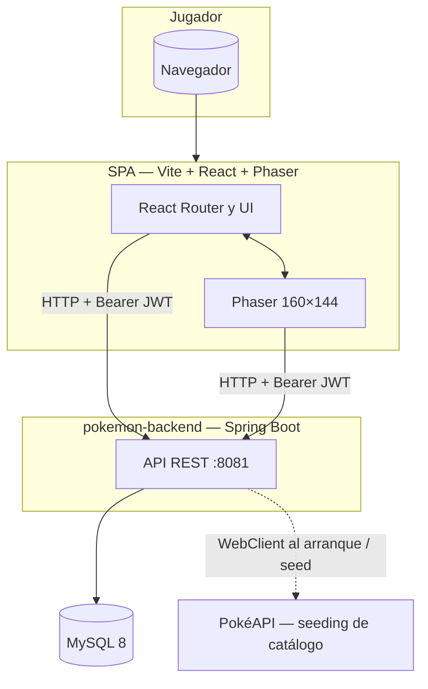


---

## 2. Rutas del cliente (React Router)

Fuente: `pokemon-frontend/src/router/EnrutadorAplicacion.jsx`.

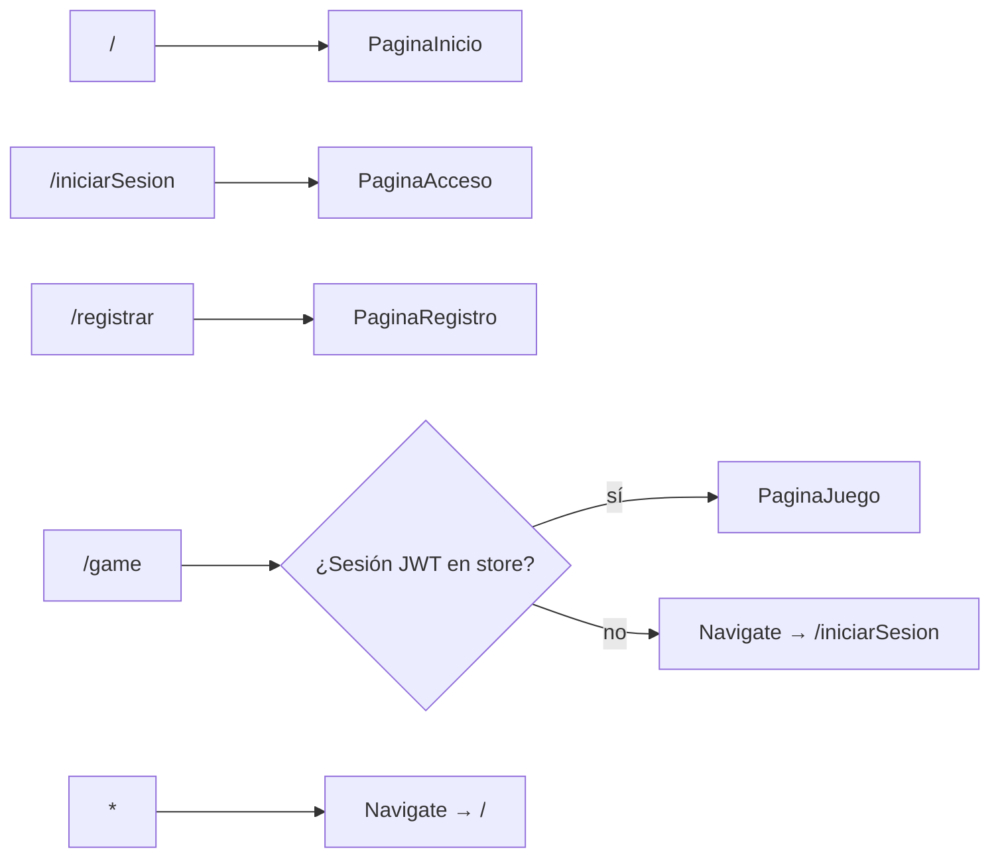


---

## 3. Cliente: React y Phaser

Resumen de cómo conviven la shell React y el juego Phaser en `/game`.

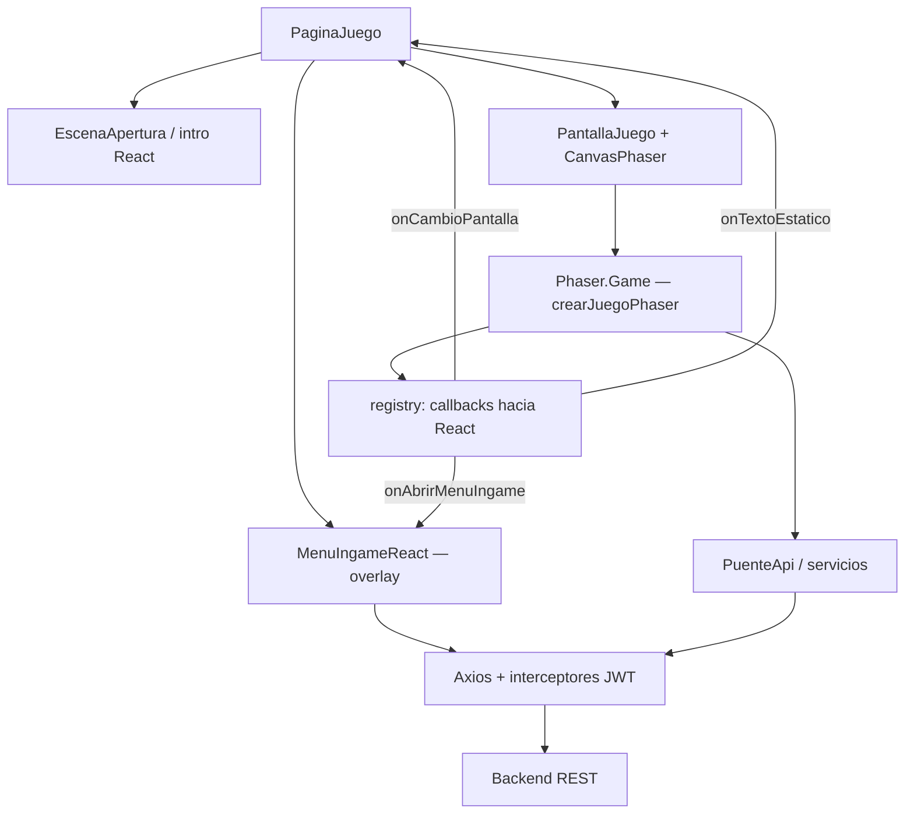


---

## 4. Escenas Phaser (orden de registro)

Fuente: `pokemon-frontend/src/phaser/PhaserJuego.js`. El flujo real entre escenas lo gobierna cada escena (`scene.start`, `launch`, etc.); este diagrama solo refleja el **orden de registro** en el motor.

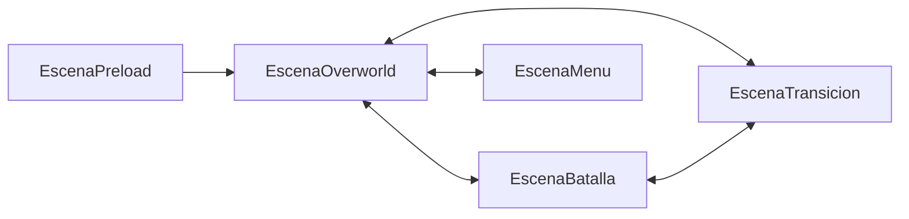


---

## 5. Capas del backend

Patrón típico Spring: controladores delgados, servicios con reglas, repositorios JPA.

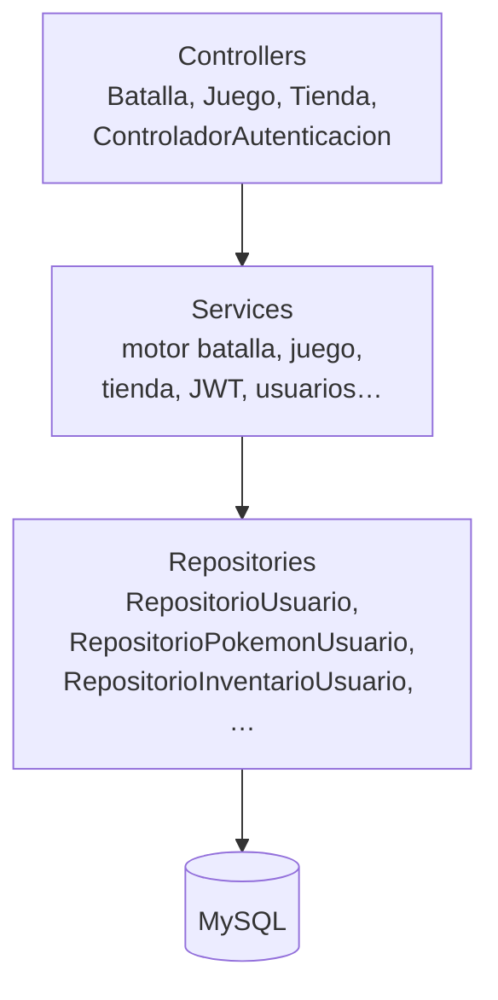


---

## 6. Spring Security: dos cadenas de filtros

Fuente: `pokemon-backend/.../config/ConfiguracionSeguridad.java`. **Orden menor = mayor prioridad** (`@Order(1)` antes que `@Order(2)`).

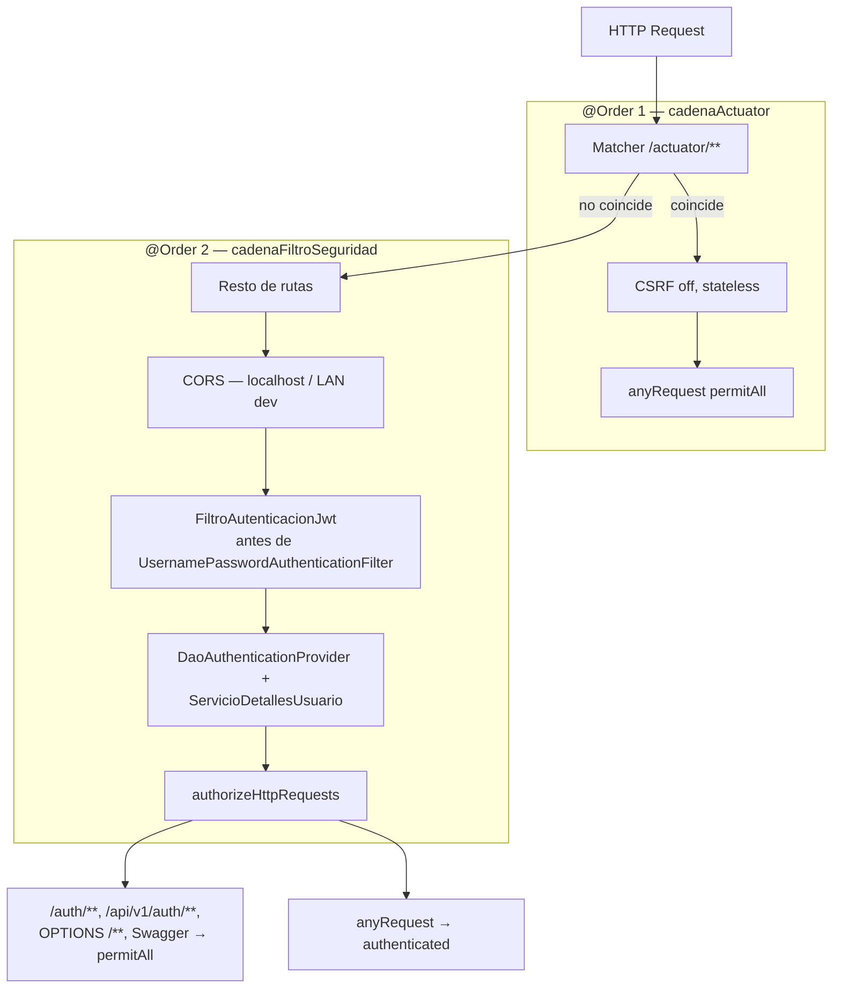


---

## 7. Secuencia: inicio de sesión y JWT

```mermaid
sequenceDiagram
  participant C as Cliente React
  participant A as ControladorAutenticacion
  participant AM as AuthenticationManager
  participant U as ServicioDetallesUsuario
  participant J as ServicioJwt

  C->>A: POST /auth/iniciarSesion
  A->>AM: authenticate credenciales
  AM->>U: loadUserByUsername
  U-->>AM: Usuario UserDetails
  AM-->>A: Authentication OK
  A->>J: generar token
  J-->>A: JWT string
  A-->>C: 200 + JWT en cuerpo / cabecera según implementación
  Note over C: El store guarda el token;\nAxios adjunta Authorization Bearer
```


---

## 8. Secuencia: petición autenticada

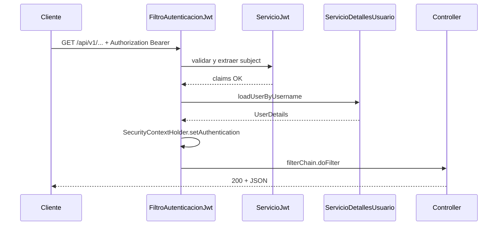


---

## 9. Secuencia: guardar partida

Representación simplificada de `POST /api/v1/juego/guardar` (mapa, posición, dinero, JSON de estado del cliente).

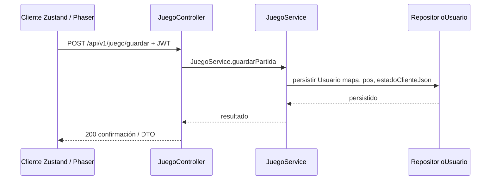


---

## 10. Secuencia: turno de batalla

Flujo típico: movimientos del Pokémon activo y resolución de turno.

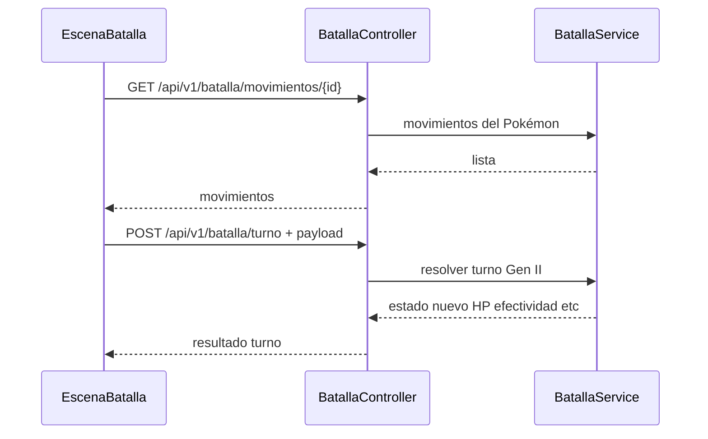


---

## 11. Mapa de endpoints REST

Resumen por controlador. El **mindmap** de Mermaid falla en muchos visores; aquí va un **flowchart** (mejor soporte) más una **tabla** con las rutas exactas.

### Tabla de rutas


| Área     | Método | Ruta                                             | Auth |
| -------- | ------ | ------------------------------------------------ | ---- |
| Actuator | GET    | `/actuator/health`                               | No   |
| Auth     | POST   | `/auth/registrar`                                | No   |
| Auth     | POST   | `/auth/iniciarSesion`                            | No   |
| Juego    | GET    | `/api/v1/juego/estado`                           | JWT  |
| Juego    | GET    | `/api/v1/juego/equipo`                           | JWT  |
| Juego    | POST   | `/api/v1/juego/starter`                          | JWT  |
| Juego    | POST   | `/api/v1/juego/guardar`                          | JWT  |
| Juego    | POST   | `/api/v1/juego/reiniciar`                        | JWT  |
| Juego    | POST   | `/api/v1/juego/inventario/anadir`                | JWT  |
| Batalla  | GET    | `/api/v1/batalla/movimientos/{pokemonUsuarioId}` | JWT  |
| Batalla  | POST   | `/api/v1/batalla/turno`                          | JWT  |
| Batalla  | POST   | `/api/v1/batalla/captura`                        | JWT  |
| Batalla  | POST   | `/api/v1/batalla/salvaje/preparar`               | JWT  |
| Batalla  | POST   | `/api/v1/batalla/salvaje/liberar`                | JWT  |
| Tienda   | POST   | `/api/v1/tienda/comprar`                         | JWT  |


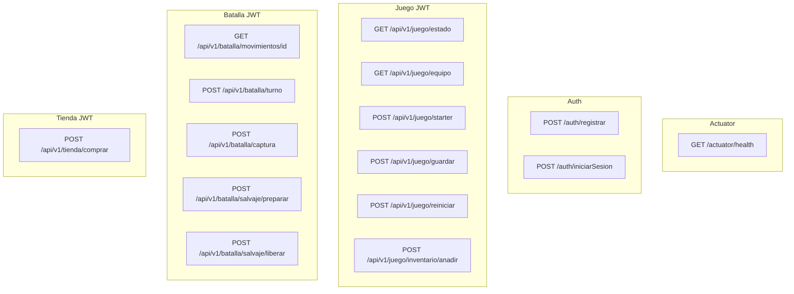


> **Seguridad:** `ConfiguracionSeguridad` también marca como público el patrón `/api/v1/auth/`** ; hoy el controlador expuesto es `/auth/...`.

---

## 12. Modelo de datos (núcleo)

**ER** (entidades JPA + tabla auxiliar de PP). El mapeo real está en las clases bajo `pokemon-backend/.../model/` y en `RepositorioEstadoMovimientoPokemon` (JDBC).

### Diagrama entidad-relación

```mermaid
erDiagram
  USUARIOS ||--o{ POKEMON_USUARIO : "id_usuario"
  POKEDEX_MAESTRA ||--o{ POKEMON_USUARIO : "id_pokedex"
  USUARIOS ||--o{ INVENTARIO_USUARIO : "id_usuario"
  ITEMS ||--o{ INVENTARIO_USUARIO : "id_item"
  POKEMON_USUARIO ||--o{ POKEMON_MOVIMIENTOS_USUARIO : "id_pokemon_usuario"
  ATAQUES ||--o{ POKEMON_MOVIMIENTOS_USUARIO : "id_ataque"

  USUARIOS {
    int idUsuario PK
    string username
    string passwordHash
    int dinero
    string mapaActual
    int posX
    int posY
    string estadoClienteJson
  }

  POKEMON_USUARIO {
    int id PK
    int id_usuario FK
    int id_pokedex FK
    int nivel
    int hp_actual
    int hp_max
    int posicion_equipo
    int ataque_stat
    int defensa_stat
    int ataque_especial_stat
    int defensa_especial_stat
    int velocidad_stat
    string estado
    int turnos_confusion
    int contador_toxico
    int turnos_sueno
    int tiene_drenadoras
  }

  POKEDEX_MAESTRA {
    int id_pokedex PK
    string nombre
    string tipo_1
    string tipo_2
    int stat_base_hp
    int ratio_captura
  }

  ITEMS {
    int id_item PK
    string nombre
    int precio
    string efecto
  }

  INVENTARIO_USUARIO {
    int id_usuario PK
    int id_item PK
    int cantidad
  }

  ATAQUES {
    int id_ataque PK
    string nombre
    string tipo
    string categoria
    int potencia
    int precision_base
    int pp_base
  }

  POKEMON_MOVIMIENTOS_USUARIO {
    int id_pokemon_usuario PK
    int id_ataque PK
    int slot_index
    int pp_actual
  }

  TIPOS {
    int idTipo PK
    string atacante
    string defensor
    float multiplicador
  }
```


### Tabla auxiliar (JDBC, no JPA)


| Tabla                         | Uso                                                                                                                              |
| ----------------------------- | -------------------------------------------------------------------------------------------------------------------------------- |
| `POKEMON_MOVIMIENTOS_USUARIO` | PP por movimiento y Pokémon; PK `(id_pokemon_usuario, id_ataque)`. Creada por `RepositorioEstadoMovimientoPokemon` si no existe. |


### Catálogo `TIPOS`

Filas de matriz atacante/defensor → multiplicador de daño. **Sin FK** hacia otras tablas: el motor consulta por nombres de tipo en runtime.

### Vista compacta (solo cardinalidad)

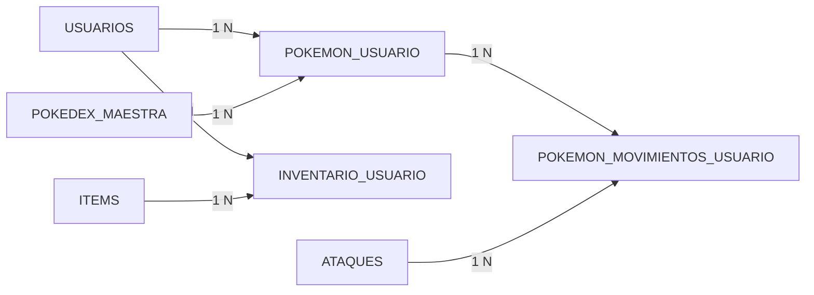


---

## 13. Casos de uso

Vista resumida del jugador frente a bloques de funcionalidad expuestos por la API (sin entrar en cada endpoint; el detalle está en la [sección 11](#11-mapa-de-endpoints-rest)).

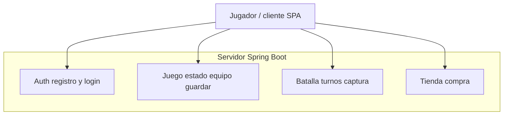


---

## 14. Modelo de dominio clases

Relaciones lógicas alineadas con las entidades JPA principales (`com.proyecto.pokemon_backend.model`).

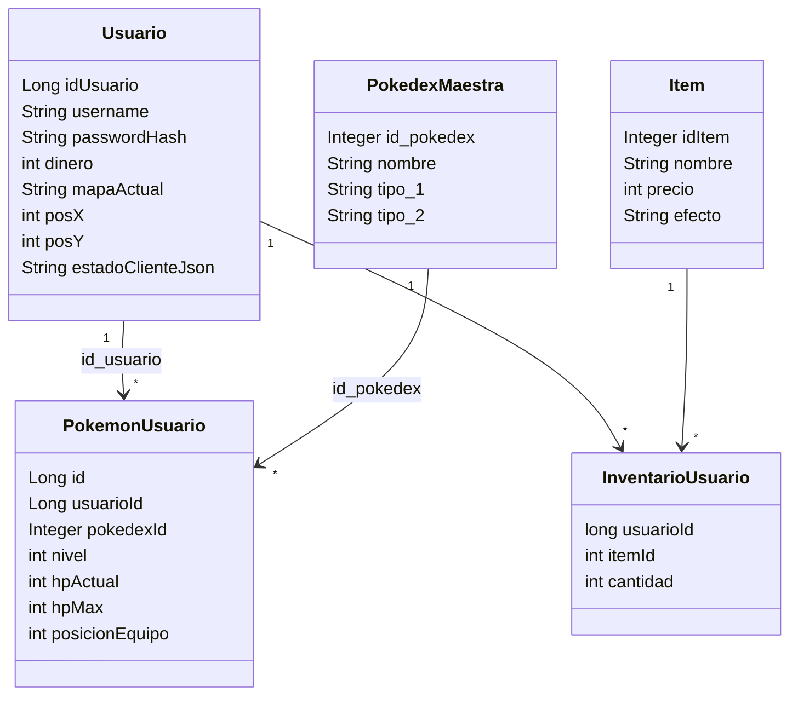


---

## 15. Compra en tienda transaccional ACID

`TiendaService.comprarItem` está anotado con `@Transactional`: el descuento de dinero y el incremento de inventario comparten commit o rollback. Código: `pokemon-backend/.../service/TiendaService.java`.

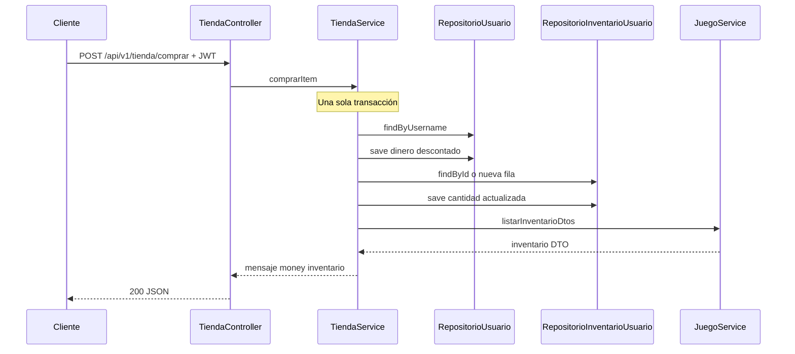


---

## 16. Captura y persistencia del Pokémon salvaje

`BatallaService.intentarCaptura`: descuenta la Ball, calcula RNG; si hay captura, reasigna `usuarioId` y `posicionEquipo` al jugador y persiste. Todo en `@Transactional`.

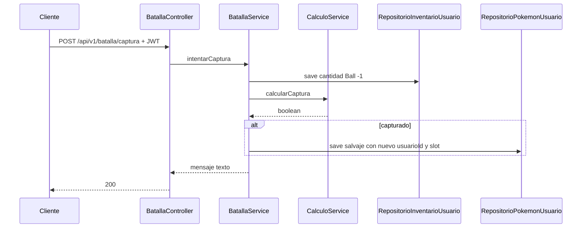


---

## 17. Arranque del servidor y carga de datos

Orden de fases al levantar Spring Boot.

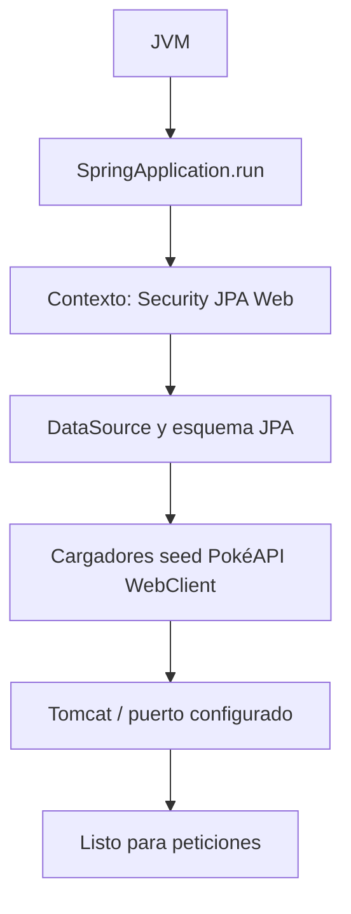


---

## 18. Algoritmo de daño Gen II

Entradas y salida según `CalculoService.calcularDanio` (comentario Javadoc en el código).

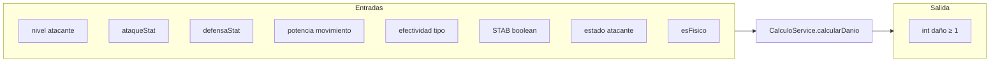


Fórmula resumida en código: `((0.2*N+1)*A*P/(D*25)+2) * STAB * E * V` con `V ∈ [0.85, 1.0)` y quemadura dividiendo ataque físico efectivo entre 2.

---

Referencias útiles:

- Seguridad y Swagger: [docs/backend/README.md](../backend/README.md)
- Tareas y bugs: [docs/dev/NOTAS.md](../dev/NOTAS.md)

